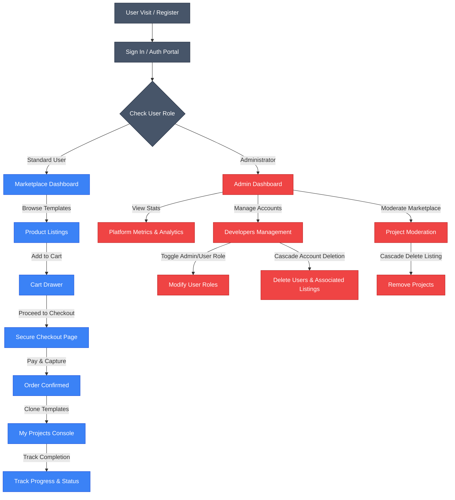
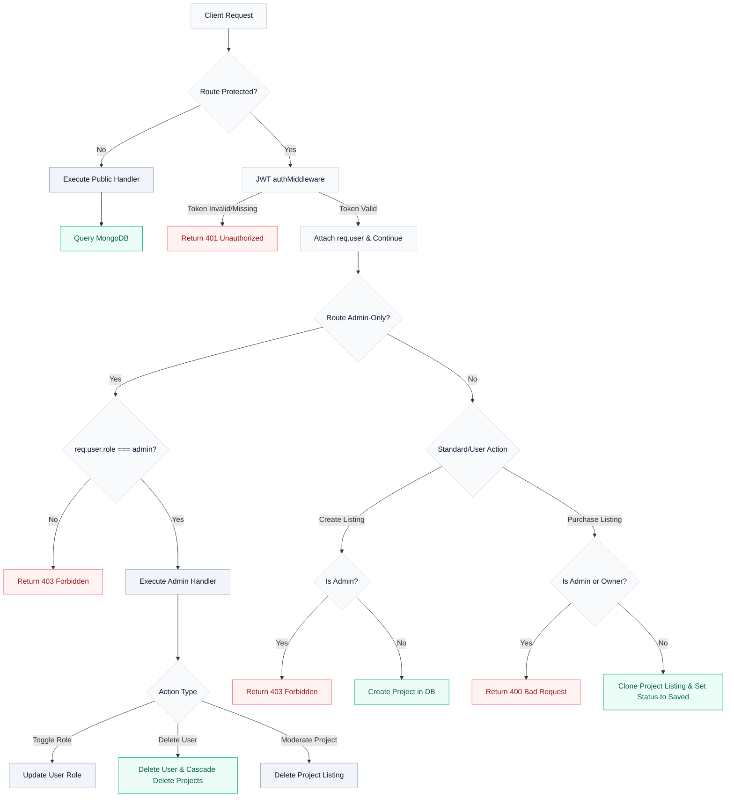
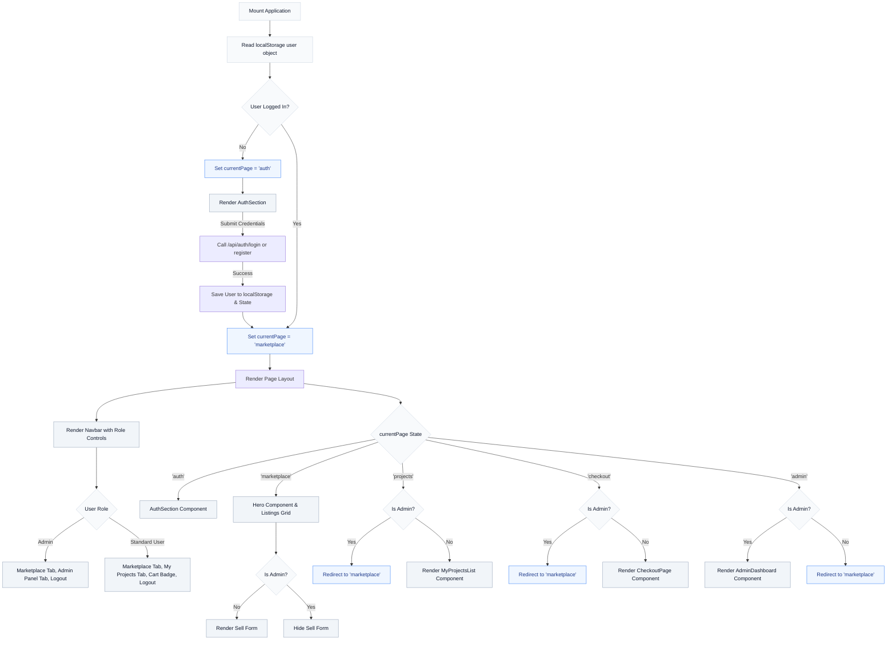

# Developer Marketplace

A full-stack Developer Marketplace application built with the MERN stack (MongoDB, Express, React, Node.js). It features a robust backend with secure authentication, role-based access control, a visual shopping cart system, checkout sequencing, and an administration control panel.

## Architecture and Workflow

The following diagram illustrates the role-based workflow and feature paths for standard developers versus platform administrators:



### Backend Architecture and API Workflow

The backend application is driven by Node.js, Express, and MongoDB. Secure access control checks, user/project model queries, role authorization checks, and cascading record deletion flow as follows:



### Frontend Architecture and Navigation Flow

The frontend is built as a single-page React 19 application using local state variables for client-side routing. Navigation checks, conditional headers, page state routers, role-based controls, and view guards flow as follows:



---

## Key Features

### User Capabilities
- **Marketplace Dashboard**: Search, filter by category, and browse listed codebase templates.
- **Sell Form**: List projects for sale specifying price, description, live links, and tech stacks.
- **Shopping Cart**: Dynamic sidebar drawer to add multiple templates, view running subtotals, and remove items.
- **Secure Checkout Sequence**: Complete shipping, billing, and mock 256-bit encrypted credit card validation.
- **My Projects Tracker**: Access cloned templates, customize completion progress rates, and manage development status (In Progress, Completed, Saved).

### Admin Capabilities
- **Admin Control Panel**: View real-time platform metrics including total active users, listed inventory size, active categories, and total portfolio valuation.
- **Developer Management**: View registered developer directory, promote/demote users between administrator and standard roles, and delete user accounts.
- **Moderation Controls**: Moderate projects by deleting listings directly from the platform.
- **Access Restrictions**: Administrators are strictly blocked from listing projects, adding items to the cart, viewing the checkout sequence, or accessing personal project consoles.

---

## Tech Stack

### Frontend
- React 19
- Vite
- Lucide React (Icons)
- Custom CSS

### Backend
- Node.js & Express (v5)
- MongoDB & Mongoose
- JSON Web Token (JWT) for authentication
- bcryptjs for password hashing

---

## Project Directory Structure

- `/frontend` - Contains the React client application, components, styling, and routes.
- `/backend` - Contains the Node/Express server, database models, controllers, and admin routes.

---

## Getting Started

### Prerequisites
- Node.js (v18 or higher)
- MongoDB (local instance running on port 27017 or a remote Atlas connection string)

### Installation and Setup

1. **Setup Backend Environment**:
   Create a `.env` file inside the `backend` directory:
   ```env
   PORT=5000
   MONGO_URI=mongodb://localhost:27017/dev_marketplace
   JWT_SECRET=your_jwt_secret_key_here
   ```

2. **Install Backend Dependencies**:
   ```bash
   cd backend
   npm install
   ```

3. **Install Frontend Dependencies**:
   ```bash
   cd ../frontend
   npm install
   ```

### Database Seeding
To populate the database with initial developer accounts and template listings, run the database seed script:
```bash
cd ../backend
npm run seed
```

This generates two pre-configured accounts:
- **Admin Account**: `admin@example.com` / password: `admin123`
- **Standard User**: `jane@example.com` / password: `developer123`

### Running the Application Locally

1. **Start the Express API Server**:
   ```bash
   cd backend
   npm run dev
   ```

2. **Start the Frontend Vite Server**:
   ```bash
   cd ../frontend
   npm run dev
   ```

   The client application will run on `http://localhost:5173/`.
